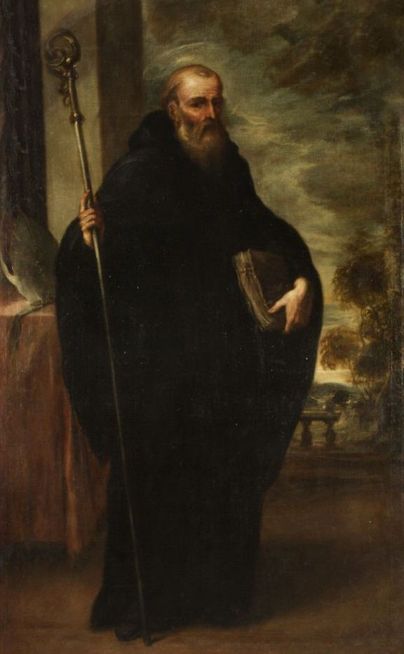

# ✝ Catequese — Adultos IC · Paróquia São José

Site estático da turma de **Iniciação Cristã de Adultos (IC) 2026** da Paróquia São José.
Desenvolvido em HTML, CSS e JavaScript puro — sem framework, sem servidor, sem banco de dados.

---

## Estrutura de arquivos

```
catequese/
├── index.html               ← Página inicial
├── santos.html              ← Página dos Santos de Devoção
├── conteudos.html           ← Página de Conteúdos dos Encontros
├── README.md                ← Este arquivo
└── src/
    └── assets/
        ├── css/
        │   └── styles.css   ← Estilos compartilhados por todas as páginas
        ├── js/
        │   └── main.js      ← Scripts compartilhados (nav ativa, scroll suave)
        └── img/
            ├── fundo.jpg           ← Imagem de fundo do hero (todas as páginas)
            ├── sao-bento.jpg       ← Foto/imagem de São Bento (index.html)
            └── encontros/
                ├── encontro-01/    ← Fotos do 1º encontro
                │   ├── foto-01.jpg
                │   ├── foto-02.jpg
                │   └── foto-03.jpg
                ├── encontro-02/    ← Fotos do 2º encontro (criar quando necessário)
                └── ...
```

> **Importante:** a pasta `img/` e seus arquivos não são gerados automaticamente.
> Você deve criar as subpastas e colocar as imagens manualmente conforme descrito abaixo.

---

## Páginas

### `index.html` — Início

Página principal do site. Contém:

| Seção | Descrição |
|---|---|
| **Nav** | Barra de navegação fixa com links para as 3 páginas |
| **Hero** | Imagem de fundo, título, subtítulo e trecho do *Veni Creator Spiritus* |
| **Faixa dourada** | Nome do santo de devoção da turma (São Bento) |
| **Sobre** | Explicação da catequese + citação de Bento XVI + 4 cards (Estudo, Oração, Sacramentos, Comunidade) |
| **Cronograma** | Timeline dos encontros com data, local e horário |
| **Material** | Lista de itens que os catequizandos devem trazer |
| **Avisos** | Cards com comunicados, lembretes e recados |
| **São Bento** | Seção dedicada ao santo da turma: imagem + biografia + citação + tags |
| **Rodapé** | Nome da catequese, paróquia, ano, frase e créditos |

---

### `santos.html` — Santos de Devoção

Página com os santos apresentados semana a semana. Contém:

| Elemento | Descrição |
|---|---|
| **Card do santo atual** | Layout em duas colunas: imagem à esquerda, texto à direita. Inclui: nome, epiteto, data da festa, biografia, citação e tags temáticas |
| **Grade de próximas semanas** | Cards compactos indicando os santos futuros (aparecem esmaecidos enquanto `tbd`) |

**Santo atual:** São Tomás de Aquino (Semana 1)

---

### `conteudos.html` — Conteúdos dos Encontros

Página com o material de cada encontro. Contém:

| Elemento | Descrição |
|---|---|
| **Encontro ativo** | Card completo com: número, título, data, horário, local, resumo e grade de materiais |
| **Encontro pendente** | Card esmaecido com mensagem "será publicado após a aula" |
| **Lightbox** | Ao clicar em uma foto, ela abre em tela cheia (fechar com clique ou tecla `Esc`) |

**Tipos de material suportados em cada encontro:**
- 📄 PDF via Google Drive
- 🔗 Link externo
- 🎥 Vídeo do YouTube (embed)
- 🖼️ Fotos/imagens com lightbox

---

## Como atualizar o site

### Adicionar um novo encontro (`conteudos.html`)

1. Localize o card `pendente` do encontro desejado:
   ```html
   <div class="encontro-card pendente" data-encontro="2">
   ```
2. **Remova** a classe `pendente`:
   ```html
   <div class="encontro-card" data-encontro="2">
   ```
3. **Substitua** o bloco `<div class="pendente-msg">` pelo bloco `.encontro-body` completo — copie do Encontro 1 como modelo e preencha com os dados reais.

---

### Adicionar PDF de um encontro

1. No Google Drive, clique com botão direito no arquivo → **Compartilhar** → **"Qualquer pessoa com o link pode ver"**
2. Copie o link gerado
3. No HTML, cole o link no `href` do mat-item correspondente:
   ```html
   <a class="mat-item" href="COLE_O_LINK_AQUI" target="_blank" rel="noopener">
   ```

---

### Adicionar vídeo do YouTube

1. Abra o vídeo no YouTube e copie a URL
2. Extraia o **ID do vídeo** — é a parte após `?v=`
   - Exemplo: `youtube.com/watch?v=`**`dQw4w9WgXcQ`**
3. No HTML, substitua `ID_DO_VIDEO`:
   ```html
   <iframe src="https://www.youtube.com/embed/dQw4w9WgXcQ" ...>
   ```

---

### Adicionar fotos de um encontro

1. Crie a pasta correspondente: `src/assets/img/encontros/encontro-02/`
2. Coloque as fotos dentro da pasta (JPG ou PNG)
3. No HTML, aponte os `src` para os arquivos:
   ```html
   
   ```
4. Adicione ou remova `` conforme o número de fotos disponíveis

> Se não tiver fotos para um encontro, apague o bloco `<div class="fotos-row">` inteiro para evitar imagens quebradas.

---

### Adicionar um novo santo semanal (`santos.html`)

1. **Duplique** o bloco `<div class="saint-card">` existente
2. Atualize `data-semana`, nome, epiteto, festa, biografia, citação e tags
3. **Mova o card anterior** para dentro de `.upcoming-grid` como um `.upcoming-card` (sem a classe `tbd`):
   ```html
   <div class="upcoming-card">
     <div class="upcoming-num">1</div>
     <div class="upcoming-info">
       <h4>Santo Tomás de Aquino</h4>
       <p>Semana 1 · 28 de Janeiro</p>
     </div>
   </div>
   ```
4. Atualize o número `data-semana` no novo card principal

---

### Adicionar imagem de um santo

Para o **card semanal** (`santos.html`), substitua o placeholder:
```html
<!-- Remova isto: -->
<div class="saint-image-placeholder"> ... </div>

<!-- Coloque isto: -->

```

Para **São Bento** na página inicial (`index.html`), mesma lógica:
```html
<!-- Remova isto: -->
<div class="bento-image-placeholder"> ... </div>

<!-- Coloque isto: -->

```

---

### Atualizar o cronograma (`index.html`)

Cada item da timeline segue este modelo. Edite os valores entre as tags:
```html
<div class="timeline-item">
  <div class="timeline-date">
    <div class="day">11</div>      <!-- dia do mês -->
    <div class="month">Mar</div>   <!-- mês abreviado -->
  </div>
  <div class="timeline-info">
    <h3>2º Encontro — Título do Tema</h3>
    <p>Local: Sala 204 · Horário: 20h</p>
    <span class="badge">11/03/2026</span>
  </div>
</div>
```

---

### Atualizar o santo de devoção (`index.html`)

Há três lugares para atualizar quando o santo da turma for definido:

1. **Faixa dourada** (logo abaixo do hero):
   ```html
   <strong>São Bento de Núrsia</strong>
   ```
2. **Seção São Bento** — texto, imagem e citação no corpo da página
3. **Rodapé**:
   ```html
   <p class="credits">Santo de devoção: São Bento de Núrsia · ...</p>
   ```

---

## Hospedagem recomendada

O site é 100% estático — funciona em qualquer serviço que sirva arquivos HTML:

| Serviço | Como fazer |
|---|---|
| **GitHub Pages** | Suba a pasta no repositório, ative Pages em Settings → Pages → Branch: main |
| **Netlify** | Arraste a pasta para [app.netlify.com/drop](https://app.netlify.com/drop) |
| **Vercel** | Conecte o repositório GitHub em [vercel.com](https://vercel.com) |

> Todos os serviços acima têm plano gratuito suficiente para este projeto.

---

## Identidade visual

| Variável CSS | Valor | Uso |
|---|---|---|
| `--gold` | `#C6A55A` | Acentos, bordas, badges principais |
| `--gold-soft` | `#D6B873` | Hover, variações suaves do dourado |
| `--cream-main` | `#F3EFE7` | Fundo principal das seções |
| `--white-soft` | `#FAF8F3` | Fundo de seções alternadas |
| `--dark` | `#1C1610` | Fundo do nav, headers de cards, rodapé |
| `--text` | `#2E2A26` | Texto principal |
| `--text-soft` | `#5E554C` | Texto secundário, descrições |

**Tipografia:**
- Títulos e destaques: `Playfair Display` (Google Fonts)
- Corpo de texto: `Lato` (Google Fonts)

---

## Observações técnicas

- O arquivo `main.js` marca automaticamente o item **ativo** no nav conforme a página atual
- O **lightbox** de fotos (`conteudos.html`) fecha com clique fora da imagem ou tecla `Esc`
- Todas as animações respeitam `prefers-reduced-motion` (acessibilidade)
- O layout é responsivo — em telas menores que 640px o nav colapsa e os grids viram coluna única
- PDFs e links externos abrem sempre em nova aba (`target="_blank" rel="noopener"`)

---

*Catequese — Adultos IC · Paróquia São José · 2026*
